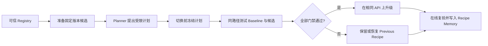

<div align="center">

# Virtual AI Infra Team

**让本地 AI 在你的机器上，自己发现、验证并安全升级推理优化。**

安装一次，持续使用同一个 OpenAI-compatible API；只有质量、速度、内存和错误门禁全部通过，候选优化才会被升级，失败则保留或恢复上一版本。

[简体中文](README.md) | [English](README_EN.md)

[](LICENSE)
[](pyproject.toml)
[](#当前支持范围)
[](#当前支持范围)

[快速开始](#快速开始) · [实测证据](#实测证据) · [工作原理](#工作原理) · [安全设计](#安全设计) · [发布时间线](#发布时间线) · [路线图](#路线图)

</div>

<p align="center">
  <a href="dashboard_productized.png">
    
  </a>
  <br>
  <sub>点击图片查看完整 Dashboard</sub>
</p>

## 它解决什么问题

本地模型部署完成后，推理栈仍在快速变化：新的 speculative decoding 方法、量化方案、runtime 版本和模型实现不断出现。今天，这些升级通常仍依赖工程师手动完成：

> 找候选 → 下载依赖 → 跑 benchmark → 检查质量 → 切换服务 → 出错后回滚

**Virtual AI Infra Team 把这套 AI Infra 工作流变成一个在用户机器上运行、受策略约束、可验证、可回滚的自动化闭环。**

它不是新的推理引擎，也不是另一个聊天 UI。它运行在现有本地 serving stack 之上，负责发现候选、冻结实验计划、执行公平测试、独立判定结果，并在同一个 API 地址上完成升级或恢复。

| 稳定接口 | 独立验证 | 可恢复升级 |
|:---:|:---:|:---:|
| 客户端始终连接 `127.0.0.1:8000/v1` | 模型只能提出计划，确定性代码负责判定 | 候选失败不会成为当前 Recipe，并触发保留或恢复 |

## 快速开始

### 当前要求

- Apple Silicon Mac；
- Python 3.11–3.13；参考环境为 Python 3.13；
- 建议至少 32 GB 统一内存；已验证的 27B 路径使用 48 GB；
- 至少 25 GB 可用磁盘空间；首次目标模型下载约 15 GB；
- 首次下载模型时可访问 Hugging Face。

### 两条命令启动

```bash
git clone https://github.com/hsj576/virtual-ai-infra-team.git
cd virtual-ai-infra-team

./scripts/bootstrap-macos.sh
./scripts/start-local-ai.sh
```

安装脚本只创建仓库内的 `.venv`，不会修改系统 Python，也不会自动安装 launchd 任务。

启动后打开：

```text
Dashboard: http://127.0.0.1:9000
API:       http://127.0.0.1:8000/v1
```

在 Dashboard 点击 **“检查并升级本地 AI”**，系统会完成一次从候选发现到在线验证的完整流程。默认 `3` 次重复是正式本地 benchmark；`1` 次重复仅用于 smoke test，不会被包装成可发布的性能结论。

停止服务：

```bash
./scripts/stop-local-ai.sh
```

## 实测证据

这不是理论峰值，也不是跨机器泛化承诺。下面的数据来自一台 Apple M5 Pro 上的真实完整运行，所有原始数值均可在仓库中重新计算。

<div align="center">

### 18.14 → 37.52 tok/s

**生成吞吐提升 106.84%，质量门禁保持 4/4，OpenAI-compatible API 地址不变。**

</div>

| 配置 | Generation TPS 中位数 | TTFT 中位数 | 峰值内存 | 质量 | 相对 Baseline |
|---|---:|---:|---:|---:|---:|
| Baseline | 18.14 | 0.230 s | 16.449 GB | 4/4 | 基准 |
| DFlash2 block 6 | 35.31 | 0.194 s | 21.876 GB | 4/4 | +94.65% |
| DFlash2 native block 8 | **37.52** | **0.189 s** | 21.725 GB | **4/4** | **+106.84%** |

测试范围：

- Apple M5 Pro，48 GB 统一内存；
- Target：`mlx-community/Qwen3.8-27B-4bit`，固定 commit `3e6447f...`；
- Drafter：`z-lab/Qwen3.8-27B-DFlash2`，固定 commit `50307d4...`；
- MLX 0.32.2、MLX-VLM 0.6.16、MLX-LM 0.31.3；
- 3 个 benchmark prompts × 3 次重复 = 每个配置 9 个性能样本；
- deterministic sampling、4/4 质量门禁、升级后在线质量验证。

代价同样公开：被选中的 DFlash2 配置将峰值内存从 16.449 GB 提高到 21.725 GB。该结果只适用于所记录的机器、runtime 和 prompt suite，并不代表所有 Mac、模型或负载都能获得约 2 倍加速。

查看完整脱敏证据：[`examples/qwen38-dflash2-m5pro/`](examples/qwen38-dflash2-m5pro/)

重新计算首页数据：

```bash
python examples/qwen38-dflash2-m5pro/verify_evidence.py
```

## 工作原理



系统由三个彼此分离的部分组成：

- **服务面**：提供稳定的 OpenAI-compatible API，管理当前已升级的 Recipe；
- **控制面**：由 Planner、Policy、Supervisor、Executor、Verifier 和 Selector 完成计划、执行、验证、升级与回滚；
- **经验面**：记录环境指纹、候选结果和失败模式，把历史 Recipe 作为下一次搜索的先验，但绝不跳过本机复验。

关键设计是：**Planner 只产生结构化计划，不拥有执行权限。** 计划在任何服务切换前被持久化冻结；即使目标模型随后离线，确定性的 Supervisor 仍可继续实验并完成恢复。

## Dashboard

Dashboard 仅绑定 loopback，首页优先展示用户真正关心的结果：

- 当前服务与稳定 API 是否健康；
- 正在发现、准备、测试、升级还是恢复；
- Baseline 与候选的速度、TTFT、内存和质量差异；
- 当前 Recipe、Previous Recipe 与可恢复状态；
- Watch 和 Recipe Memory 摘要；
- 与当前部署模型的真实流式对话；
- 与实时运行明确区分的历史真实证据回放。

Manifest hash、固定 revision、Planner 来源和 Artifact 名称等技术字段被保留在可展开详情中，不占据首屏。

## 安全设计

- 模型输出永远不会作为 Shell 执行；
- Manifest 只能选择代码内置的固定启动模板，未知候选会被拒绝；
- 默认禁用 remote code，Target 与候选都绑定固定 revision；
- Planner、Policy 和 Manifest 的门槛取最严格组合；
- 4 个质量检查必须全部通过，请求错误必须为 0；
- 候选在隔离子进程中运行，Supervisor 不加载模型权重；
- Dashboard 只监听本机，写操作需要同源校验、内存 session token 和用户二次确认；
- 未知进程占用服务端口时，系统会拒绝操作，而不是将其杀死；
- 只有服务健康且在线质量复验通过后，Active Recipe 才会提交。

安全问题与支持范围见 [SECURITY.md](SECURITY.md)。

## 当前支持范围

当前 `v0.1` 是面向开发者和研究者的 preview，重点证明一条完整、可信的本地自优化路径：

| 维度 | 当前支持 |
|---|---|
| 平台 | Apple Silicon + macOS |
| Serving runtime | MLX-VLM |
| Target | Qwen3.8-27B 4-bit |
| 已验证候选 | DFlash2 |
| API | OpenAI-compatible，loopback |
| 切换方式 | 单机 maintenance window，不宣称零停机 |
| Registry | 包内可信 Registry，固定 revision |

当前不适合：只需要云 API 或聊天应用的用户、低于资源要求的设备、要求生产 SLA/零停机的服务，以及期望 v0.1 自动支持任意模型、runtime、操作系统或 remote code 的场景。

## 进阶命令

<details>
<summary>展开 CLI 示例</summary>

```bash
# 启动或检查稳定服务
./.venv/bin/infra-team serve start --name default
./.venv/bin/infra-team serve status --name default

# 查看并准备可信候选
./.venv/bin/infra-team registry list
./.venv/bin/infra-team registry inspect qwen38-dflash2-v1 --json
./.venv/bin/infra-team candidates prepare qwen38-dflash2-v1

# 运行一次完整演进
./.venv/bin/infra-team evolve --once --service-name default --repeats 3

# 持续监听本地可信 Registry
./.venv/bin/infra-team evolve --watch --service-name default

# 查看本地经验
./.venv/bin/infra-team memory show
```

默认 Autonomy Policy 已随 Python 包发布；wheel 安装后，即使离开源码目录，`registry`、`candidates`、`evolve` 和 `memory` 仍可使用。可通过 `--policy /path/to/policy.yaml` 显式覆盖。

</details>

## 开发与验证

```bash
python3 -m venv .venv
./.venv/bin/pip install -e '.[dev]'
./.venv/bin/python -m pytest tests -q
./.venv/bin/python -m compileall -q src
python -m build
```

当前本地 release candidate 通过 **167 个自动化测试**。CI 在 macOS 上覆盖 Python 3.10–3.13，并检查源码编译、证据重算、wheel/sdist 构建、仓库外 wheel 安装、包内 Registry/Policy，以及意外凭据和个人绝对路径。

## 发布时间线

- **2026.09.08** — 发布 **v0.1 Developer Preview**：首次公开 Apple Silicon 上的本地 AI 自优化闭环，包括稳定的 OpenAI-compatible API、可信候选发现、独立质量与性能门禁、安全升级与恢复、Recipe Memory 和 Dashboard。

## 路线图

发布 `v0.1` 前后的优先事项：

- 由非作者完成干净 Apple Silicon 安装测试；
- 补充 p95 latency、服务切换中断、接受率和重复冷启动证据；
- 发布真实候选失败与回滚演示；
- 完成 90 秒产品 Demo 和无剪辑完整运行视频；
- 提供签名发布产物并收集安装反馈。

更长期的扩展将由真实使用决定，包括 Homebrew/签名 macOS 分发、更多可信 runtime 与模型、签名远程 Registry，以及 Linux/NVIDIA 与企业控制能力。

## 参与项目

- [贡献指南](CONTRIBUTING.md)
- [安全策略](SECURITY.md)
- [行为准则](CODE_OF_CONDUCT.md)
- [变更记录](CHANGELOG.md)
- [本地 Release Candidate 状态](docs/RELEASE_STATUS.md)
- [维护者发布检查单](docs/RELEASE_CHECKLIST.md)
- [第三方模型与依赖](THIRD_PARTY.md)

如果你在另一台 Apple Silicon Mac 上完成安装、运行了不同 workload，或希望贡献新的可信候选，请通过 [Issues](https://github.com/hsj576/virtual-ai-infra-team/issues) 提交可复现的信息。

## 引用、作者与许可证

项目由 [Shijing Hu](https://github.com/hsj576) 维护。引用本项目或公开证据包时请使用 [`CITATION.cff`](CITATION.cff)。

代码采用 [Apache-2.0](LICENSE) 许可证。模型权重及第三方依赖遵循各自许可证，本仓库不重新分发模型权重。
