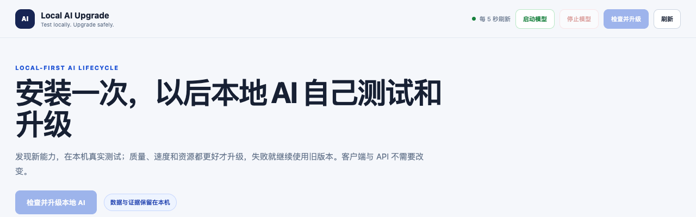
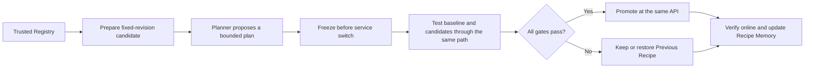

<div align="center">

# Virtual AI Infra Team

**Let your local AI discover, verify, and safely adopt inference optimizations on your own machine.**

Install once and keep the same OpenAI-compatible API. A candidate is promoted only after every quality, speed, memory, and error gate passes; otherwise, the previous working version is retained or restored.

[简体中文](README.md) | [English](README_EN.md)

[](https://github.com/hsj576/virtual-ai-infra-team/actions/workflows/ci.yml)
[](LICENSE)
[](pyproject.toml)
[](#current-scope)
[](#current-scope)

[Quick start](#quick-start) · [Verified evidence](#verified-evidence) · [How it works](#how-it-works) · [Safety](#safety-by-design) · [Release timeline](#release-timeline) · [Roadmap](#roadmap)

</div>

<p align="center">
  <a href="dashboard_productized.png">
    
  </a>
  <br>
  <sub>Click the image to open the complete Dashboard</sub>
</p>

## The problem

A local model deployment is never truly finished. New speculative decoding methods, quantization schemes, runtime versions, and model implementations keep appearing. Today, adopting them usually requires an engineer to do the entire upgrade manually:

> find a candidate → download assets → benchmark it → check quality → switch the service → recover from failure

**Virtual AI Infra Team turns that AI Infra workflow into a policy-bounded, verifiable, and recoverable loop that runs on the user's machine.**

It is not another inference engine or chat UI. It sits above an existing local serving stack, discovers candidates, freezes experiment plans, runs fair comparisons, makes independent decisions, and either promotes an improvement at the same API address or restores the previous recipe.

| Stable API | Independent verification | Recoverable upgrades |
|:---:|:---:|:---:|
| Clients keep using `127.0.0.1:8000/v1` | The model may propose a plan, but deterministic code decides | A failed candidate never becomes active and triggers retention or recovery |

## Quick start

### Requirements

- Apple Silicon Mac;
- Python 3.10–3.13; Python 3.13 is the reference environment;
- at least 32 GB unified memory recommended; the verified 27B path used 48 GB;
- at least 25 GB free disk space; the first target-model download is about 15 GB;
- Hugging Face access for the initial model download.

### Start with two commands

```bash
git clone https://github.com/hsj576/virtual-ai-infra-team.git
cd virtual-ai-infra-team

./scripts/bootstrap-macos.sh
./scripts/start-local-ai.sh
```

The installer creates only a repository-local `.venv`. It does not modify system Python or install a launchd task.

Then open:

```text
Dashboard: http://127.0.0.1:9000
API:       http://127.0.0.1:8000/v1
```

Click **"检查并升级本地 AI"** in the Dashboard to run the complete path from candidate discovery to online verification. The default `3` repeats are the formal local benchmark mode. A `1`-repeat run is only a smoke test and is never presented as publishable performance evidence.

Stop the preview:

```bash
./scripts/stop-local-ai.sh
```

## Verified evidence

This is not a theoretical peak or a cross-machine performance promise. The following numbers come from one complete real run on an Apple M5 Pro, and every headline value can be recomputed from the public bundle in this repository.

<div align="center">

### 18.14 → 37.52 tok/s

**Generation throughput improved by 106.84%, quality remained 4/4, and the OpenAI-compatible API address did not change.**

</div>

| Configuration | Generation TPS median | TTFT median | Peak memory | Quality | vs. baseline |
|---|---:|---:|---:|---:|---:|
| Baseline | 18.14 | 0.230 s | 16.449 GB | 4/4 | reference |
| DFlash2 block 6 | 35.31 | 0.194 s | 21.876 GB | 4/4 | +94.65% |
| DFlash2 native block 8 | **37.52** | **0.189 s** | 21.725 GB | **4/4** | **+106.84%** |

Evaluation scope:

- Apple M5 Pro with 48 GB unified memory;
- target `mlx-community/Qwen3.8-27B-4bit` at fixed commit `3e6447f...`;
- drafter `z-lab/Qwen3.8-27B-DFlash2` at fixed commit `50307d4...`;
- MLX 0.32.2, MLX-VLM 0.6.16, and MLX-LM 0.31.3;
- 3 benchmark prompts × 3 repeats = 9 performance samples per configuration;
- deterministic sampling, 4/4 quality gates, and online quality verification after promotion.

The cost is reported too: peak memory rose from 16.449 GB to 21.725 GB for the selected DFlash2 recipe. These results apply only to the recorded machine, runtime, and prompt suite. They do not imply that every Mac, model, or workload will achieve an approximately 2x speedup.

Inspect the complete sanitized bundle: [`examples/qwen38-dflash2-m5pro/`](examples/qwen38-dflash2-m5pro/)

Recompute the headline values:

```bash
python examples/qwen38-dflash2-m5pro/verify_evidence.py
```

## How it works



The system separates three planes:

- **Service plane**: exposes the stable OpenAI-compatible API and manages the active recipe;
- **Control plane**: Planner, Policy, Supervisor, Executor, Verifier, and Selector coordinate planning, execution, verification, promotion, and rollback;
- **Experience plane**: environment fingerprints, candidate outcomes, and failure modes make prior recipes useful for search, but never allow the system to skip local revalidation.

The key boundary is that **the Planner can produce structured plans but has no execution authority**. The plan is persisted and frozen before any service switch. Even if the target model then goes offline, the deterministic Supervisor can finish the experiment and recover the service without asking the Planner again.

## Dashboard

The loopback-only Dashboard keeps the first screen focused on outcomes:

- whether the current service and stable API are healthy;
- whether the system is discovering, preparing, testing, promoting, or recovering;
- baseline-versus-candidate speed, TTFT, memory, and quality;
- Active Recipe, Previous Recipe, and recovery status;
- Watch and Recipe Memory summaries;
- real streaming chat through the currently deployed model;
- historical real-run evidence replay, clearly separated from live evolution.

Technical fields such as Manifest hashes, fixed revisions, Planner sources, and artifact names remain available in expandable details instead of dominating the product view.

## Safety by design

- Model output is never executed as Shell;
- Manifests can select only code-owned launch templates, and unknown candidates are rejected;
- remote code is disabled by default, while target and candidate revisions are fixed;
- Planner, Policy, and Manifest thresholds combine to the strictest effective gate;
- all four quality checks must pass, and request errors must be zero;
- candidates run in isolated child processes while the Supervisor stays free of model weights;
- the Dashboard listens only on loopback, and mutations require same-origin checks, an in-memory session token, and explicit user confirmation;
- an unknown process occupying the service port is refused rather than killed;
- the Active Recipe is committed only after service health and online quality verification pass.

See [SECURITY.md](SECURITY.md) for the security policy and support scope.

## Current scope

The current `v0.1` developer preview focuses on proving one complete, trustworthy local self-optimization path:

| Dimension | Current support |
|---|---|
| Platform | Apple Silicon + macOS |
| Serving runtime | MLX-VLM |
| Target | Qwen3.8-27B 4-bit |
| Verified candidate | DFlash2 |
| API | OpenAI-compatible, loopback only |
| Switching | Single-machine maintenance window; no zero-downtime claim |
| Registry | Package-local trusted Registry with fixed revisions |

It is not currently a good fit for users who only need a cloud API or chat application, devices below the resource requirements, services that require production SLA or zero-downtime switching, or anyone expecting v0.1 to support arbitrary models, runtimes, operating systems, or remote code.

## Advanced CLI

<details>
<summary>Expand command examples</summary>

```bash
# Start or inspect the stable service
./.venv/bin/infra-team serve start --name default
./.venv/bin/infra-team serve status --name default

# Inspect and prepare trusted candidates
./.venv/bin/infra-team registry list
./.venv/bin/infra-team registry inspect qwen38-dflash2-v1 --json
./.venv/bin/infra-team candidates prepare qwen38-dflash2-v1

# Run one complete evolution
./.venv/bin/infra-team evolve --once --service-name default --repeats 3

# Continuously watch the trusted local Registry
./.venv/bin/infra-team evolve --watch --service-name default

# Inspect local experience
./.venv/bin/infra-team memory show
```

The default Autonomy Policy is packaged with the Python distribution. After wheel installation, `registry`, `candidates`, `evolve`, and `memory` still work outside the source checkout. Use `--policy /path/to/policy.yaml` to override it explicitly.

</details>

## Development and verification

```bash
python3 -m venv .venv
./.venv/bin/pip install -e '.[dev]'
./.venv/bin/python -m pytest tests -q
./.venv/bin/python -m compileall -q src
python -m build
```

The current local release candidate passes **167 automated tests**. CI covers Python 3.10–3.13 on macOS and checks source compilation, evidence recomputation, wheel/sdist builds, clean wheel installation outside the checkout, packaged Registry and Policy resources, and accidental credentials or personal absolute paths.

## Release timeline

- **2026.09.08** — Released **v0.1 Developer Preview**: the first public version of the local AI self-optimization loop on Apple Silicon, including a stable OpenAI-compatible API, trusted candidate discovery, independent quality and performance gates, safe promotion and recovery, Recipe Memory, and the Dashboard.

## Roadmap

Priorities before or immediately after `v0.1`:

- clean Apple Silicon installation tests by non-authors;
- p95 latency, service-switch interruption, acceptance-rate, and repeated cold-start evidence;
- a public real candidate-failure and rollback demonstration;
- a 90-second product demo and an uncut full-run recording;
- signed release artifacts and broader installation feedback.

Longer-term expansion will follow real usage: Homebrew or signed macOS distribution, more trusted runtimes and models, a signed remote Registry, and Linux/NVIDIA and enterprise control features.

## Contributing

- [Contributing guide](CONTRIBUTING.md)
- [Security policy](SECURITY.md)
- [Code of conduct](CODE_OF_CONDUCT.md)
- [Changelog](CHANGELOG.md)
- [Local release-candidate status](docs/RELEASE_STATUS.md)
- [Maintainer release checklist](docs/RELEASE_CHECKLIST.md)
- [Third-party models and dependencies](THIRD_PARTY.md)

If you complete an installation on another Apple Silicon Mac, test a different workload, or want to contribute a new trusted candidate, please open an [Issue](https://github.com/hsj576/virtual-ai-infra-team/issues) with reproducible information.

## Citation, author, and license

Maintained by [Shijing Hu](https://github.com/hsj576). Use [`CITATION.cff`](CITATION.cff) when referencing the project or its public evidence bundle.

The code is licensed under [Apache-2.0](LICENSE). Model weights and third-party dependencies retain their own licenses and are not redistributed by this repository.
